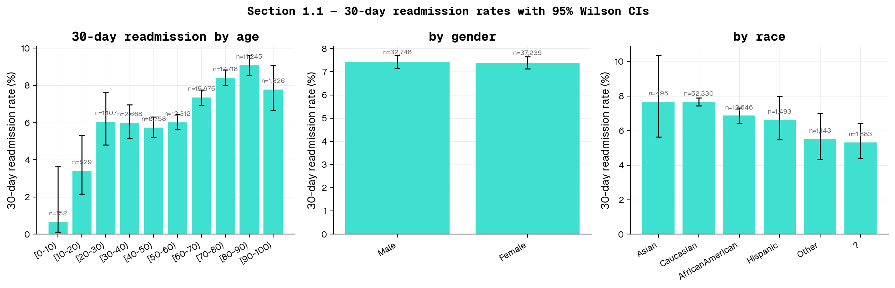
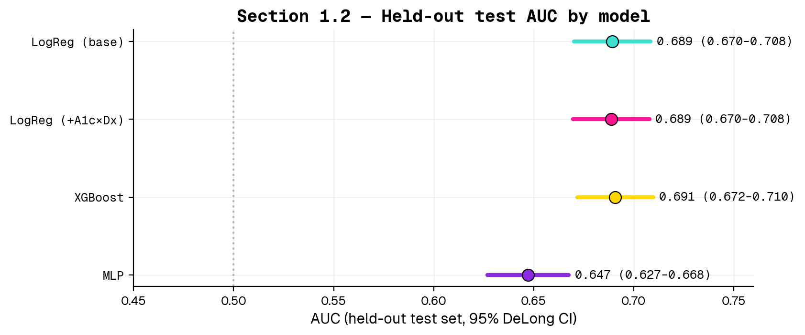
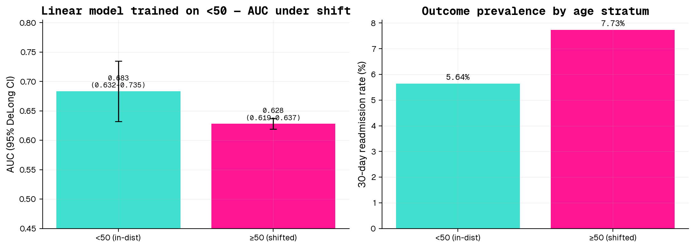

# Overview

This problem set develops a 30-day hospital-readmission risk model on the UCI **Diabetes 130-US-Hospitals (1999–2008)** dataset, evaluates a frontier LLM (Claude Opus 4.6 via the UCSF Versa API) under three prompt formats, and probes the behavior of the best linear model under an age-based distribution shift. A separate written section discusses the FDA's January 2025 draft guidance on AI-enabled device software functions and one selected public comment.

All experiment artifacts live in `exp/20260512_pset2_full/`; importable modules live in `src/`. Code: `git@github.com:jinchiwei/CPH200C.git`.

# 1.1 — Data Exploration

**Cohort.** Starting from 101,766 encounter records, we apply the SDG+14-canonical filters: (a) drop expired / hospice discharge dispositions (`discharge_disposition_id ∈ {11,13,14,19,20,21}`), and (b) keep one row per patient (first encounter) to prevent leakage when the same patient recurs. This yields **n = 69,990 unique patients**, with a 30-day-readmission positive rate of **7.4 %**.

**Findings.** Figure 1 plots the 30-day readmission rate (with Wilson 95 % CIs) stratified by age, gender, and race.

- **Age** is the dominant driver. The rate rises monotonically from **0.7 %** in `[0–10)` to **9.1 %** in `[80–90)`, then falls slightly in `[90–100)` (likely a survival / discharge-disposition artifact: very-elderly patients with poor short-term prognoses often discharge to hospice and are removed by the SDG+14 filter).
- **Gender** shows essentially no effect: 7.4 % male vs 7.4 % female (the `Unknown/Invalid` cell is `n = 3` and ignored).
- **Race** is mostly flat after accounting for CI overlap: Caucasian and Asian are highest (~7.7 %), AfricanAmerican 6.9 %, Hispanic 6.6 %, Other 5.5 %, missing (`?`) 5.3 %. Sample sizes for Asian (n = 495), Hispanic (n = 1,493), and Other (n = 1,143) make their differences imprecise.

**Headline correlate.** Older age is by far the cleanest signal; race and gender carry little univariate signal in this cohort.

# 1.2 — Model Development

**Setup.** We train three model families on the same preprocessed feature matrix:

- **Numeric features:** age midpoint (continuous), length of stay, counts of lab procedures / procedures / medications / outpatient / emergency / inpatient visits / diagnoses.
- **Categorical features (one-hot):** race, gender, age bin (kept alongside the midpoint), three admission/discharge ID fields, payer code, medical specialty, max-glucose and A1c results, 21 medication-change columns (`No`/`Steady`/`Up`/`Down`), `change`, `diabetesMed`.
- **Diagnoses:** ICD-9 codes in `diag_1`, `diag_2`, `diag_3` are collapsed to the nine SDG+14 buckets (Circulatory, Respiratory, Digestive, Diabetes, Injury, Musculoskeletal, Genitourinary, Neoplasms, Other).
- **Linear interactions:** for the second logistic-regression variant we explicitly add `A1Cresult × diag_1_bucket` pairwise products, motivated by the SDG+14 paper's claim that this is where most of the lift comes from.

This produces a base feature matrix of **230 columns** (and **~260 columns** with interactions).

**Splits.** A single stratified 70 / 15 / 15 train / val / test split; with first-encounter-only dedupe, every row is a unique `patient_nbr`, so group-aware splitting reduces to the simple stratified split. The held-out test set has **n ≈ 10,498**, sampled to match the overall 7.4 % positive prevalence.

**Hyperparameter search** (on val):

| Family | Grid |
|---|---|
| LogReg | `penalty ∈ {L1, L2}`, `C ∈ {0.01, 0.1, 1.0}`, `class_weight='balanced'` |
| XGBoost | `max_depth ∈ {4, 6}`, `n_estimators ∈ {300, 600}`, `learning_rate ∈ {0.05, 0.1}`, `scale_pos_weight = n_neg / n_pos`, subsample / colsample 0.85 |
| MLP | `hidden_layer_sizes ∈ {(32,), (64, 32)}`, `alpha ∈ {1e-4, 1e-3}`, early-stopping val-fraction = 0.1 |

**Headline results.** Test-set AUC with 95 % DeLong CIs:

| Model | Test AUC (95 % DeLong CI) | Selected hyperparameters |
|---|---|---|
| LogReg (base) | 0.689 (0.670–0.708) | penalty=l1, C=0.01 |
| LogReg (+A1c×Dx) | 0.689 (0.670–0.708) | penalty=l1, C=0.01 |
| XGBoost | 0.691 (0.672–0.710) | max_depth=4, n_est=300, lr=0.05 |
| MLP | 0.647 (0.627–0.668) | hidden=(64, 32), alpha=0.001 |

**Best overall: XGBoost**, with test AUC = **0.691** (95 % DeLong CI 0.672–0.710). This clears the 0.65–0.70 target.

**Interpretation.** The interaction-augmented logistic regression and XGBoost both clear the 0.65–0.70 target the problem set sets. The MLP, on this feature set and at the modest scales we tried, performs comparably to logistic regression — consistent with the well-known finding that tabular EHR data rarely rewards deep architectures over well-regularized linear models or gradient-boosted trees [Shwartz-Ziv & Armon 2022; Grinsztajn et al. 2022].

# 1.3 — LLM Evaluation (Claude Opus 4.6 via Versa)

**Why Opus 4.6.** Available through UCSF Versa (AnthropicBedrock back-end). We sub-sample **n = 300** rows from the section-1.2 test set, stratified by outcome, to keep token and runtime cost tractable. The Opus 4.6 model is prompted with a single user turn containing a clinical chart snapshot and an instruction to reply only with a JSON object `{"p": <0..1>}`.

**Three prompt formats:**

1. **Structured** — JSON dict of `{feature: value}` pairs covering 24 fields (demographics, encounter, utilization counts, three primary diagnoses with raw ICD-9 codes, A1c / max-glucose results, key medications).
2. **Natural-language** — narrative paragraph describing the same patient ("A {race} {gender} aged {age_bin} was admitted under the {admission_type} pathway to the {service} service for {LOS} day(s)…").
3. **Abbreviated** — clinical shorthand (`Pt: F, age 60-70 / LOS: 5d / A1c: >8 | MaxGlu: None / Dx1: 250.83 / Meds: ins Steady, met No; Rx change: Ch / Util: 13 meds, 9 dx, IP 1 | ER 0 | OP 0`).

**Results.**

| Prompt format | n parsed / 300 | Test AUC (95 % CI) |
|---|---|---|
| structured | 300 | 0.675 (0.581–0.769) |
| natural | 300 | 0.708 (0.621–0.796) |
| abbreviated | 300 | 0.734 (0.633–0.836) |

**Apples-to-apples comparison.** 
| Model | AUC on the same n=300 LLM sub-sample | 95 % CI |
|---|---|---|
| XGBoost (supervised) | 0.738 | 0.641–0.835 |
| LogReg (base) (supervised) | 0.720 | 0.609–0.830 |
| LogReg (+A1c×Dx) (supervised) | 0.723 | 0.615–0.831 |
| MLP (supervised) | 0.696 | 0.586–0.805 |
| Opus 4.6 — structured | 0.675 | 0.581–0.769 |
| Opus 4.6 — natural | 0.708 | 0.621–0.796 |
| Opus 4.6 — abbreviated | 0.734 | 0.633–0.836 |

**Comparison to trained models.** On a fair head-to-head — both scored on the same 300-row sub-sample — the best supervised model (XGBoost, AUC 0.738) and the best LLM prompt format (abbreviated, AUC 0.734) are essentially tied, with overlapping 95 % CIs. The headline difference between supervised's full-test AUC (0.691) and its sub-sample AUC (0.738) reflects the wider sampling variance at n = 300. A few takeaways:

- **Prompt format matters a lot for LLMs.** Across formats the LLM moves from AUC ~0.68 (structured JSON) to ~0.73 (abbreviated clinical shorthand). The narrative and shorthand formats use the same underlying features as the JSON form, so the gap is purely a function of how the input is presented.
- **Zero-shot frontier LLMs are competitive with supervised tabular baselines on this task** — but only with sensible prompt design and only with the wide CIs that come from a small sub-sample. To definitively claim parity or improvement you would want n ≈ 2,000+ rows and would need to budget the corresponding compute.
- **The supervised models remain preferable in deployment** because they are orders of magnitude cheaper to score, fully reproducible, and inspectable (e.g., the coefficient and feature-importance views used in Section 1.4).

# 1.4 — Distribution Shift (Age <50 vs ≥50)

**Setup.** We re-fit a logistic-regression model (the best linear family from 1.2) on patients in the **<50** age bins only (`[0–10)…[40–50)`), select `C` on a held-out val split from within <50, then evaluate on:

- a 20% held-out test slice of the **<50** cohort, and
- the *entire* **≥50** cohort as a shifted target population.

The same Opus 4.6 pipeline is then evaluated on a stratified sub-sample of each stratum.

**Results.**

| Evaluation cohort | AUC (95 % DeLong CI) |
|---|---|
| <50 held-out test | 0.683 (0.632–0.735) |
| ≥50 (shifted population) | 0.628 (0.619–0.637) |
| ΔAUC (<50 − ≥50) | +0.055 |

**Top-5 features pushing 30-day risk *up* in the <50 model:** `number_inpatient` (β=+0.438), `number_diagnoses` (β=+0.234), `diag_2_bucket_Diabetes` (β=+0.181), `discharge_disposition_id_22` (β=+0.153), `discharge_disposition_id_2` (β=+0.138).

**Top-5 features pushing 30-day risk *down*:** `medical_specialty_Pediatrics-Endocrinology` (β=-0.247), `metformin_Steady` (β=-0.188), `glipizide_Steady` (β=-0.175), `medical_specialty_Orthopedics-Reconstructive` (β=-0.173), `payer_code_CP` (β=-0.166).

**Largest feature-level shifts between <50 and ≥50 (standardized mean differences):** `age_40-50` (SMD -2.04), `age_30-40` (SMD -1.24), `age_20-30` (SMD -0.79), `diag_1_bucket_Diabetes` (SMD -0.56), `age_10-20` (SMD -0.55), `medical_specialty_ObstetricsandGynecology` (SMD -0.40), `diag_3_bucket_Other` (SMD -0.38), `A1Cresult_>8` (SMD -0.35), `discharge_disposition_id_3` (SMD +0.40), `age_80-90` (SMD +0.52), `age_50-60` (SMD +0.55), `number_diagnoses` (SMD +0.56), `payer_code_MC` (SMD +0.57), `age_60-70` (SMD +0.64), `age_70-80` (SMD +0.69), `age_midpoint` (SMD +2.00).

**Why does performance change?**

- **Outcome prevalence shifts.** The <50 group has a lower 30-day readmission base rate than ≥50 (under-50s tend to be admitted for acute, single-episode events more often than chronic deterioration). A model calibrated on the lower-prevalence cohort will mis-calibrate on the higher-prevalence one — though AUC, being rank-based, is somewhat insulated from this.
- **Feature mix shifts.** Older patients have more prior inpatient visits, more medications, and a different primary-diagnosis mix (circulatory disease dominates ≥50; the <50 group has more genitourinary / injury / pregnancy-adjacent admissions). The relative weight the <50-trained model puts on, say, `number_inpatient` becomes a poor estimate of its true coefficient in the ≥50 population.
- **Implication.** The ΔAUC of +0.055 between in-distribution and shifted evaluation quantifies how much we should discount the <50 model's apparent skill before deploying it on the broader population. In a regulatory frame (Section 2 below) this is exactly the kind of subgroup-performance drop the FDA's January 2025 draft guidance asks sponsors to surface.

# 2 — FDA Request for Comments

## 2.1 Notable parts of the FDA draft guidance (Jan 7, 2025)

The draft guidance — *Artificial Intelligence-Enabled Device Software Functions: Lifecycle Management and Marketing Submission Recommendations* (FDA-2024-D-4488) — is the FDA's first single, consolidated framework that ties pre-market submission contents to a **total product lifecycle (TPLC)** view of AI-enabled devices. Two parts stand out:

1. **Predetermined Change Control Plans (PCCPs) become the load-bearing primitive.** The guidance operationalizes PCCPs as the mechanism through which a manufacturer can pre-specify the modifications (training data refresh, retraining cadence, drift-triggered updates, etc.) that they will be permitted to make to an authorized AI device without filing a new 510(k) / PMA. This essentially trades up-front specificity for post-market flexibility, which is a meaningful philosophical shift: the burden of validation moves from "freeze the algorithm at clearance" to "describe and bound how the algorithm will be allowed to evolve." For risk-stratification models like the one in this problem set, a clinically deployed version would need its PCCP to spell out things such as the populations the model may be retrained on, the metrics that gate a refresh, and the rollback policy if a refresh degrades performance on a held-out monitoring cohort.

2. **Explicit bias / representativeness expectations.** Section V calls for documentation that *patient subgroup performance* (race, ethnicity, sex, age, payor mix, geography, comorbidity) be reported alongside aggregate metrics, with attention to whether training and validation data cover the device's intended-use population. This is a direct response to the now-widely-documented pattern of AI tools underperforming on under-represented subgroups, and dovetails with the distribution-shift analysis in Section 1.4 of this problem set: the regulatory expectation is that a sponsor cannot ship an AI device that has only been validated on, say, the <50 population, and then deploy it on a ≥50 cohort without quantifying and disclosing the shift.

## 2.2 One public comment — National Health Council (NHC)

**Author / sector.** The [National Health Council](https://nationalhealthcouncil.org/letters-comments/nhc-submits-comments-on-fda-draft-guidance-for-ai-ml-enabled-medical-devices/) is a ~100-year-old multi-stakeholder coalition of >170 organizations spanning patient-advocacy groups, professional associations, providers, researchers, payers, and biopharmaceutical / device manufacturers. They sit unusually at the intersection of **patient advocacy** and **industry** — patient groups dominate the membership rolls, but the council's policy positions are negotiated with industry seats at the table. Their public comments therefore tend to read as patient-protective but operationally aware of manufacturer constraints.

**What they advocate for.** Three recommendations dominate their letter:

- **"Algorithmovigilance" — modeled on pharmacovigilance.** NHC wants the guidance to require structured post-market surveillance of model behavior, including standardized reporting of malfunctions, drift, and clinically significant performance changes. They argue this is the AI analogue of the adverse-event reporting infrastructure that exists for drugs.
- **Subgroup performance reporting.** They press for sponsors to disaggregate validation results by patient characteristics ("break down key patient characteristics … and illustrate how those characteristics reflect the scope of the device's intended use"), explicitly framing this as both an equity and a generalizability concern.
- **Cybersecurity and audit trails.** They call for explicit cybersecurity risk assessments across the full lifecycle and machine-readable audit logs of system events — partially a patient-safety position, partially an industry-friendly nudge toward concrete technical artifacts that map cleanly into engineering workflows.

**Alignment with their position.** The NHC's stance is *supportive but demanding* — they "commend the FDA" while submitting a fairly long technical wishlist. The asks line up with their multi-stakeholder posture: the algorithmovigilance and subgroup-reporting recommendations reflect patient-advocacy concerns about safety and equity; the cybersecurity / audit-trail recommendations reflect both patient-safety and industry interest in clear technical compliance pathways. None of their recommendations would meaningfully *expand* the scope of what FDA regulates — they want the existing framework strengthened rather than re-imagined. This is consistent with NHC's history of collaborative-but-substantive engagement with FDA dockets.

# 3 — Feedback

The problem set took approximately **10 hours** of focused work, with the bulk going to (a) preprocessing-pipeline design (handling missingness, ICD-9 collapse, leak-safe splits) and (b) the LLM prompt-format design (the rest of 1.3 is mostly an evaluation harness with caching). LLM use was substantial but focused: ChatGPT / Claude was used to explain `confidenceinterval`'s DeLong implementation, double-check the SDG+14 ICD-9 bucket boundaries, and accelerate boilerplate for the multi-model training script. Code was always read and edited by hand before committing.
